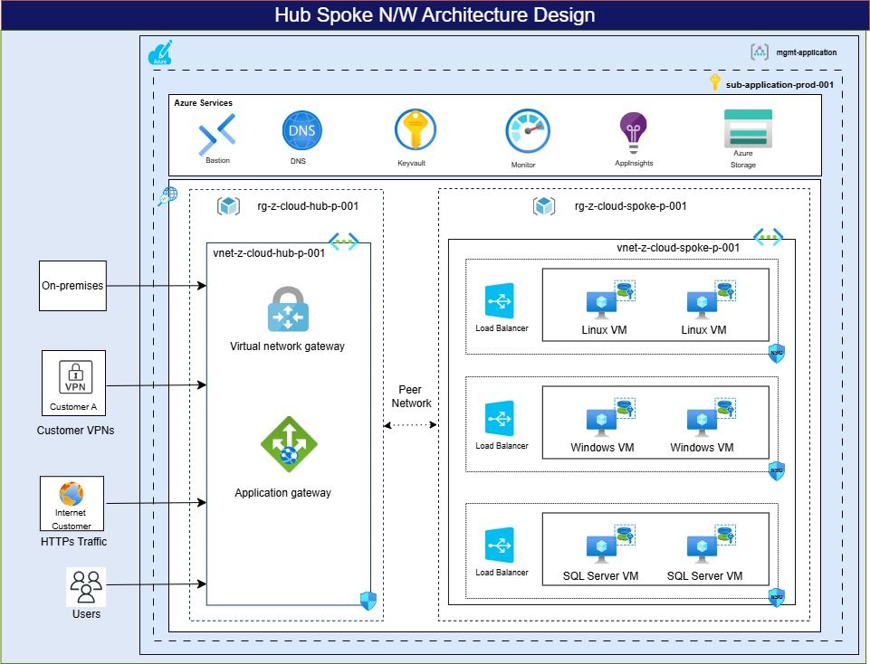

## Hub-Spoke Network Landing Zone Accelerator
This landing zone accelerator provides a foundational setup for organizations, whether migrating existing applications or deploying new ones to Azure. The architecture supports starting small and scaling according to business needs.

Upon deployment, it creates two virtual networks (Hub and Spoke) in separate resource groups within a subscription. The Hub virtual network includes a Virtual Network Gateway for on-premises or customer network connectivity (site-to-site or point-to-site) and an Application Gateway for managing internet traffic. The Spoke virtual network supports deploying various types of VMs, including Linux, Windows, and SQL Server.

## Follow the below instructions to deploy the ARM template

